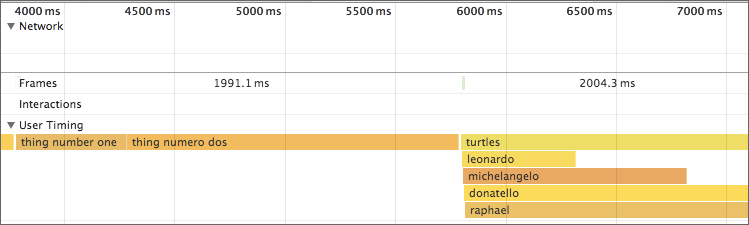

markymark
======

JavaScript performance timer based on `performance.mark()` and `performance.measure()` (i.e. the
[User Timing API](http://caniuse.com/#feat=user-timing)), which provides high-resolution
timings as well as nice Dev Tools visualizations. Also uses
[PerformanceObserver](https://developer.mozilla.org/en-US/docs/Web/API/PerformanceObserver) for
minimum impact on app runtime performance.

In Node, it uses `process.hrtime()`. For browsers that don't support `PerformanceObserver`, it falls back to polling. For
browsers that don't support `performance.mark()`, it falls back to `performance.now()` or `Date.now()`.

Quick start
----

Install via npm:

    npm install markymark

Or as a script tag:

```html
<script src="https://unpkg.com/markymark/dist/markymark.min.js"></script>
```

Then take some measurements:

```js
var markymark = require('markymark');

markymark.start('expensive operation');
doExpensiveOperation();
markymark.end().then(function (duration) {
  console.log('took: ' + duration);
});
```

Why?
---

First, `mark()` and `measure()` are [more performant than `console.time()`/`console.timeEnd()`](https://twitter.com/Runspired/status/811007272671293440), and more accurate than `Date.now()`.

Also, you get nice visualizations in Chrome Dev Tools:



As well as Edge F12 Tools:


Plus, you can easily send these measurements to your own analytics provider, because they're just standard
[PerformanceEntry](https://developer.mozilla.org/en-US/docs/Web/API/PerformanceEntry)s:

```js
// get all startTimes, names, and durations
var measurements = performance.getEntriesByType('measure');
```

API
---

`markymark.start()` begins recording, and `markymark.end()` finishes recording:

```js
markymark.start('defendTheCastle');
defendTheCastle();
markymark.end();
```

You can also provide a string to `end()` for more complex scenarios:

```js
function defendTheCastle() {
  markymark.start('defendTheCastle');
  markymark.start('releaseTheHounds');
  releaseTheHounds();
  markymark.end();
  markymark.start('armTheCannons');
  armTheCannons();
  markymark.end();
  markymark.end('defendTheCastle');
}
```

If you don't provide an argument to `end()`, it will use the name from the most recent `start()`.

Asynchronous measurements
----

`markymark.end()` returns a `Promise` for the measurement of the duration:

```js
markymark.start('manTheTorpedos');
manTheTorpedos();
markymark.end().then(function (duration) {
  console.log('duration'); // duration in milliseconds
});
```

The reason this is done asynchronously is because of how
[PerformanceObserver](https://developer.mozilla.org/en-US/docs/Web/API/PerformanceObserver) works; it
allows the browser to schedule the measurement work in the most optimal way.

Browser support
----

Markymark doesn't require ES6 syntax, but it does use `Promise` and `Map`. If your target environment doesn't support those,
you'll need a polyfill. Or you can use:

```js
var markymark = require('markymark/with-polyfills');
```

Or as a script tag:

```html
<script src="https://unpkg.com/markymark/dist/markymark.with-polyfills.min.js"></script>
```

Markymark is tested in the following browsers (with the Promise+Map polyfills):

* IE 9+
* Safari 8+
* iOS 8+
* Android 4.4+
* Chrome
* Firefox
* Edge

Node 4+ is supported.
